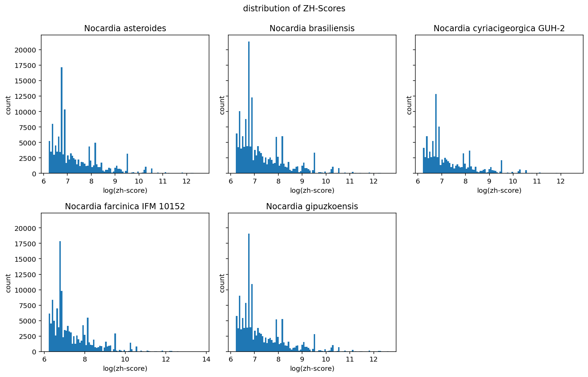
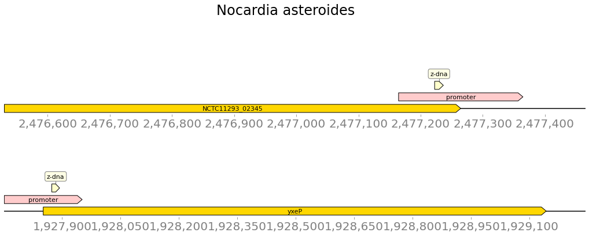
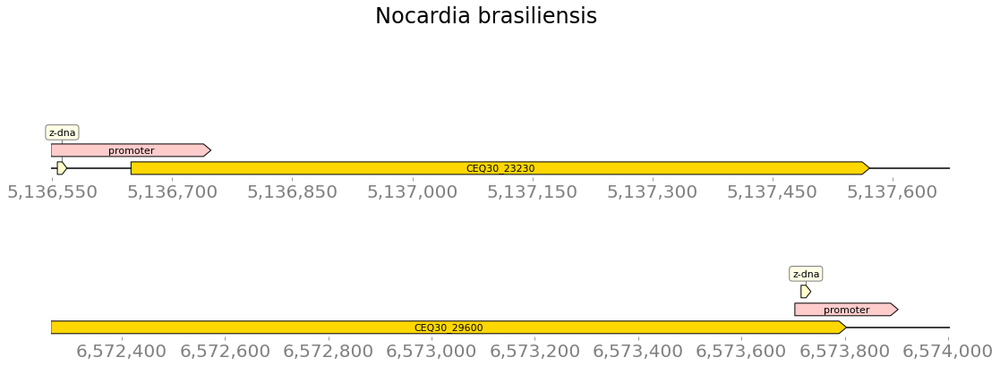
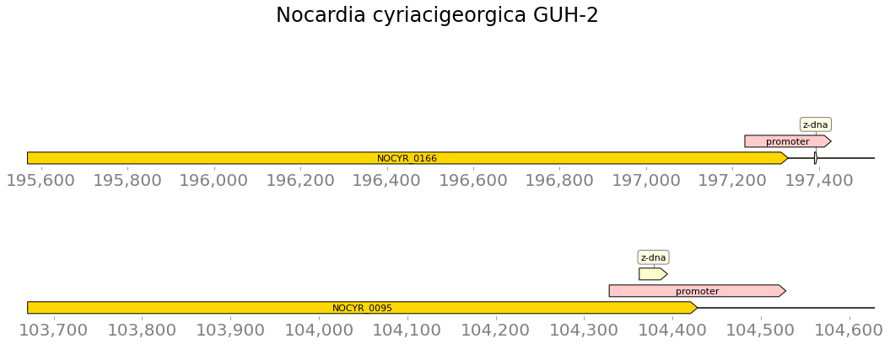
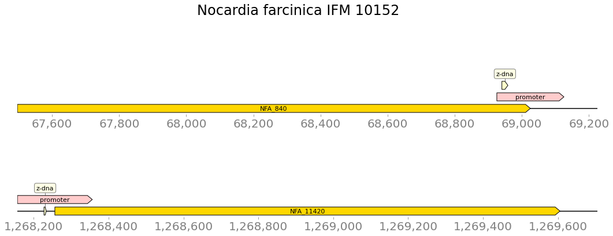
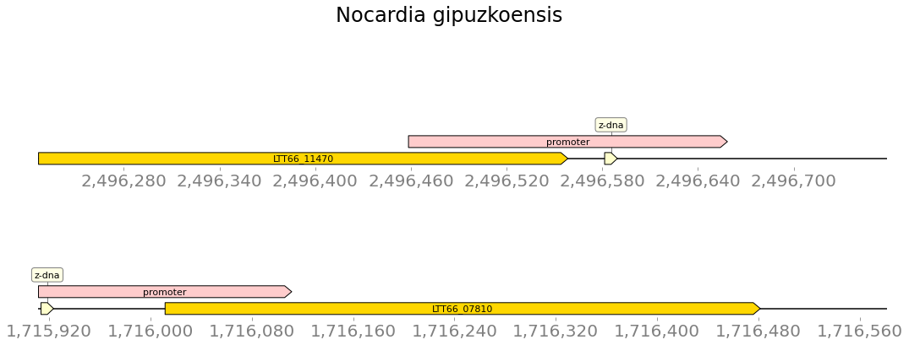

### Аннотация генов

|name|n genes|genome len|coverage|
|---|---|---|---|
|Nocardia asteroides|6983363\.0|6445\.0|0\.8970324183348338|
|Nocardia brasiliensis|8935513\.0|8095\.0|0\.8805400428604379|
|Nocardia cyriacigeorgica GUH-2|6194645\.0|5560\.0|0\.872594797603414|
|Nocardia farcinica IFM 10152|6292344\.0|6010\.0|0\.9046534963759133|
|Nocardia gipuzkoensis|8118644\.0|7404\.0|0\.8693170928544225|

### предсказанные участки

filtered - ZH-Score > 500

|name | # of seqs |	total len |	# of seqs filtered 	|total len filtered|
|---|---|---|---|---|
|Nocardia asteroides 	|6983363 	|67704448 	|134026 	|1340590|
|Nocardia brasiliensis 	|8935513 	|86133422 	|168358 	|1684604|
|Nocardia cyriacigeorgica GUH-2 	|6194645 	|59835182 	|100844 	|1008176|
|Nocardia farcinica IFM 10152 	|6021225 	|58650142 	|133333 	|1348706|
|Nocardia gipuzkoensis 	|8118644 	|78353576 	|148542 	|1484870|

### гистограмма значений zh-score

### пересечения с промотерами

